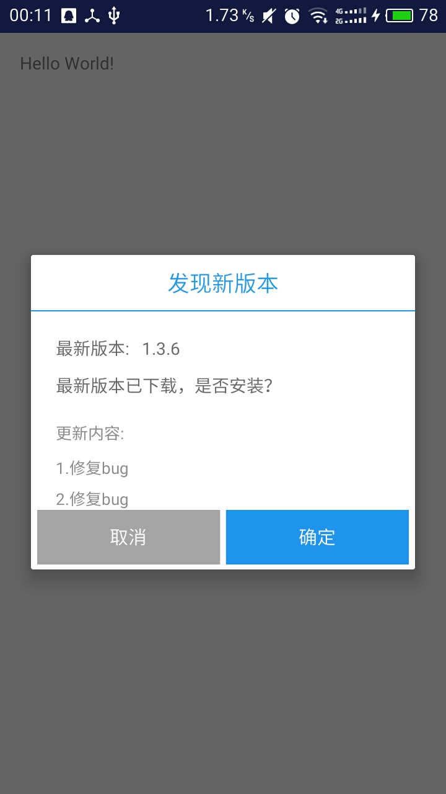
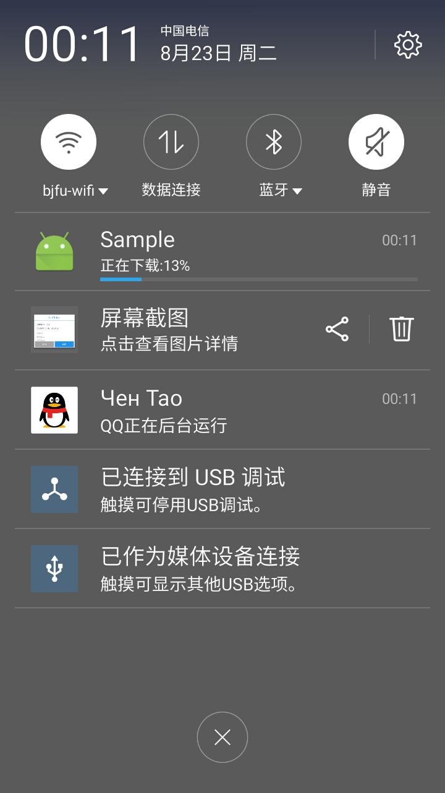
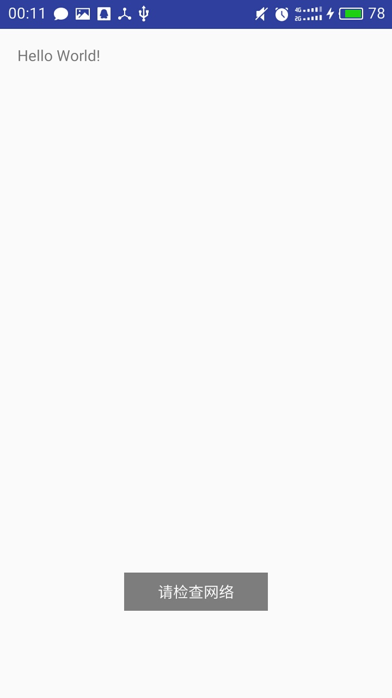
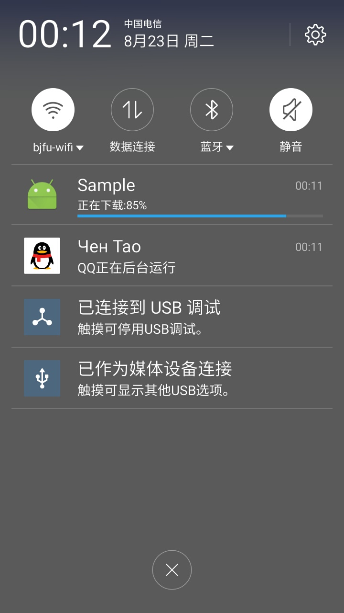
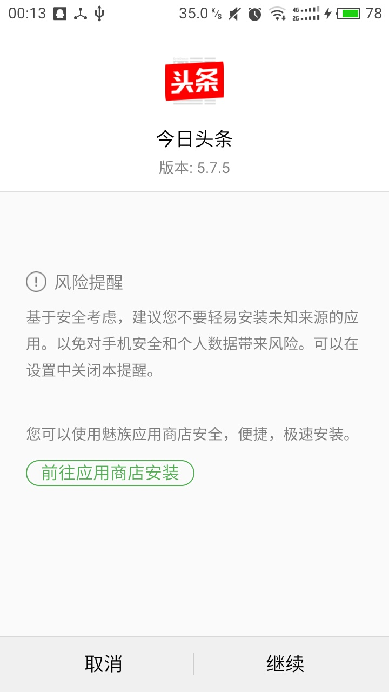

# 支持断点续传的安卓应用自动更新库

一个  **操作简单**  、  **支持断点续传**  、  **安全性能较高**  的安卓应用更新库

## 特点

1. 步骤简单，几行代码就搞定
2. 用户实现是否更新接口，有助于用户自定义
3. 断点续传，断网后，当启动网络后继续下载
4. 安全，代码操作进行大量捕获异常，降低报错几率
5. UI比较美观

## 使用方法

1. 导入library到自己项目,library为项目中的autoupdate
 
 **Android Studio:**

   * 直接下载本项目,其中autoupdate为本项目的library,直接使用即可
 
 **Eclipse:**

   * 下载本项目

   * 导入autoupdate中的java目录下的文件到自己项目中

   * 将autoupdate文件夹中的layout下的auto_update_dialog.xml拷贝到自己项目中的layout中

     **注:**

     > 如果不是导入java目录下的文件到自己的项目中，则在接下来的服务和广播注册时，请填写对应的name值。<br/>
     > 广播的类名为: **NetworkReceiver**<br/>
     > 服务的类名为: **DownloadService**

2. 添加权限网络权限

 ```xml
 <uses-permission android:name="android.permission.INTERNET" />
 <uses-permission android:name="android.permission.ACCESS_NETWORK_STATE" />
 ```

3. 注册服务和广播

 ```xml
 <receiver   
    android:name="com.chengtao.autoupdate.receiver.NetworkReceiver"
    android:label="NetworkConnection">
    <intent-filter>
        <action android:name="android.net.conn.CONNECTIVITY_CHANGE"/>
        <action android:name="com.chengtao.autoupdate.service.ACTION_UPDATE"/>
    </intent-filter>
 </receiver>
 <service android:name="com.chengtao.autoupdate.service.DownloadService" />
 ```     

4. 在程序中添加自动更新代码
 ```java
 //数据准备
 String json = "{VersionCode:10036, "+
 "VersionName:1.3.6, UpdateMessage:'1.修复BUG<br>2.修复BUG', "+
 "ApkUrl:'http://apk.hiapk.com/appdown/com.ss.android.article.news'}";
 //初始化自动更新
 AutoUpdate autoUpdate = new AutoUpdate(MainActivity.this, json);
 //实现接口
 autoUpdate.setAutoDialogListener(new AutoUpdateDialog.AutoUpdateDialogListener() {
    @Override
    public void onClick(int status) {
        switch (status) {
            case AutoUpdateDialog.UPDATE:
                Toast.makeText(MainActivity.this, "UPDATE", Toast.LENGTH_SHORT).show();
                break;
            case AutoUpdateDialog.CANCEL:
                Toast.makeText(MainActivity.this, "CANCEL", Toast.LENGTH_SHORT).show();
                break;
        }
    }
 });
 ```

    **注:**

    > **代码中的json字符串必须符合以下要求**<br>   
    1. 参数
      1. VersionCode(Integer)  --  版本号  --  不区分大小写
      2. VersionName(String)  --  版本  --  不区分大小写
      3. UpdateMessage(String)  --  更新信息(一般为html代码)  -- 不区分大小写
      4. ApkUrl(String)  --  安装包地址  --  不区分大小写

5. 参考
 
 本项目中的sample为Andriod Studio项目，大家可以参考使用

## 效果展示







### 感谢

- [慕课网](http://www.imooc.com/)
- [@feicien](https://github.com/feicien/android-auto-update)


### 问题反馈

- 若有问题，请发我邮件：chengtaolearn@163.com